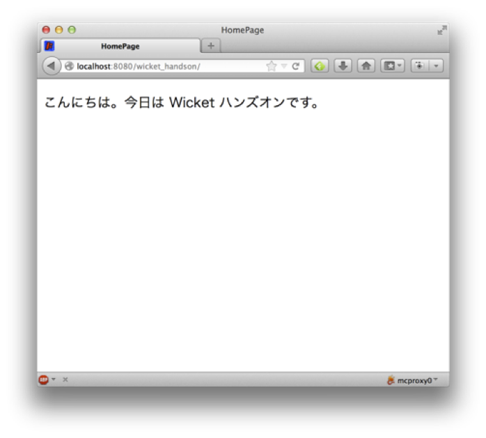

# Apache Wicket 7.x Hands-On

## Wicket でWebページを作ってみる

org.wicket_sapporo.handson パッケージに、以下のファイルを作る

HomePage.html

```html
<!DOCTYPE html>
<html xmlns:wicket="http://wicket.apache.org">
<head>
  <meta charset="UTF-8"/>
  <title>HomePage</title>
</head>
<body>
<h1>このページはWicketで動作しています</h1>
<p wicket:id="label1">message is here.</p>
</body>
</html>
```

HomePage.java

```java
package org.wicket_sapporo.handson;
import org.apache.wicket.markup.html.WebPage;
import org.apache.wicket.markup.html.basic.Label;
import org.apache.wicket.model.IModel;
import org.apache.wicket.model.Model;
 
public class HomePage extends WebPage {
  private static final long serialVersionUID = 1L;

  public HomePage() {
    String message = "こんにちは。今日はWicketハンズオンです。";
    IModel<String> label1Model = Model.of(message);
    Label label1 = new Label("label1", label1Model);
    add(label1);
  }
}
```

アプリケーションを起動して、ブラウザでhttp://localhost:8080/wicket_handson/ を表示し、動作を確認する。
「こんにちは。今日は Wicket ハンズオンです。」というメッセージが表示されればOK。



