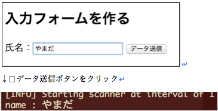

## 2. Formを作る

### 手順1

`org.wicket_sapporo.handson.basic` パッケージに以下の2つのファイルを作る。

FormPage.html

```html
<!DOCTYPE html>
<html xmlns:wicket="http://wicket.apache.org">
<head>
  <meta charset="UTF-8">
  <title>FormPage</title>
</head>
<body>
<h2>入力フォームを作る</h2>
<form wicket:id="form">
  氏名：<input type="text" wicket:id="name">
  <button type="submit">データ送信</button>
</form>
</body>
</html>
```


FormPage.java

```java
public class FormPage extends WebPage {
	private static final long serialVersionUID = 1L;

	// name の値を格納するModel
	private IModel<String> nameModel;
	
	/**
	 * コンストラクタ.
	 */
	public FormPage() {
		nameModel = Model.of("");

		// Formタグ用の Form コンポーネント
		Form<Void> form = new Form<Void>("form") {
			private static final long serialVersionUID = 1L;

			@Override
			protected void onSubmit() {
				// submit ボタンがクリックされた時の処理
				super.onSubmit();
				System.out.println("name : " + nameModel.getObject());
			}
		};
		add(form);

		// name を入力する input tyepe="text" 用のコンポーネント
		TextField<String> nameField = new TextField<>("name", nameModel);
		form.add(nameField);
	}
}		
```

### 手順2

HomePage.htmlの body タグ内に以下を追加する。

```html
<dl>
  <dt>基本編</dt>
  <dd><a wicket:id="toFormPage">FormPageへ</a></dd>
</dl>
```

HomePage.java のコンストラクタに以下を追加する。

```java
Link<Void> toFormPageLink = new Link<Void>("toFormPage") {
private static final long serialVersionUID = 1L;

  @Override
  public void onClick() {
    setResponsePage(new FormPage());
  }
};
add(toFormPageLink);
```

### 動作確認

アプリケーションを再起動して、ブラウザで [http://localhost:8080/](http://localhost:8080/)  から FormPage に移動して動作を確認する。

フォームに入力して送信した文字列がコンソールに表示されればOK。



----

[ハンズオン3へ](./HandsOn03.md)
