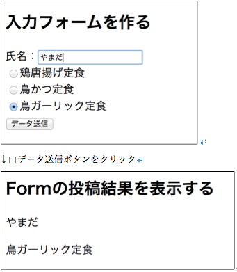

## 4. 確認ページを作ってみる

`org.wicket_sapporo.handson.basic` パッケージに以下の2つのファイルを作る。

ConfirmationPage.html

```html
<!DOCTYPE html>
<html xmlns:wicket="http://wicket.apache.org">
<head>
  <meta charset="UTF-8"/>
  <title>ConfirmationPage</title>
</head>
<body>
<h2>Formの投稿結果を表示する</h2>
<p wicket:id="name"></p>
<p wicket:id="lunch"></p>
</body>
</html>
```

ConfirmationPage.java

**練習： nameModel, lunchModelの内容が表示されるページになるように修正しなさい。**

```java
package org.wicket_sapporo.handson.basic;
 
import org.apache.wicket.markup.html.WebPage;
import org.apache.wicket.model.IModel;
 
public class ConfirmationPage extends WebPage {
  private static final long serialVersionUID = 1L;

  public ConfirmationPage(IModel<String> nameModel, IModel<String> lunchModel) {
 
     // 練習の内容を満たすように自分で書いてみてください。
 
   }
}
```

FormPage.java の Form の onSubmit メソッド内に、以下のコードを追加する。

```java
setResponsePage(new ConfirmationPage(nameModel, lunchModel));
```

アプリケーションを再起動して、ブラウザで [http://localhost:8080/](http://localhost:8080/)  からFormPageに移動し、動作を確認する。
入力フォームから送信すると画面遷移し、送信した値が表示されればOK。



<!-- [次へ](./HandsOn04.md) -->
