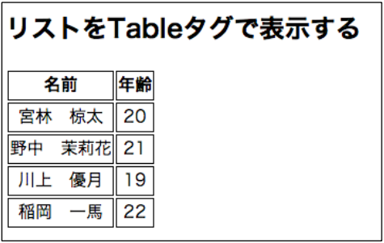

## 6. ListView でテーブル(表)を作ってみる

### 手順1

`org.wicket_sapporo.handson.listView` パッケージに以下のファイルを作る。

ListViewTablePage.html

```html
<!DOCTYPE html>
<html xmlns:wicket="http://wicket.apache.org">
<head>
	<meta charset="UTF-8"/>
	<title>ListViewTablePage</title>
	<style>
		<!--
		th, td {
			text-align: center;
			border: solid thin black;
		}

		-->
	</style>
</head>
<body>
<h2>リストをTableタグで表示する</h2>
<table>
	<tr>
		<th>名前</th>
		<th>年齢</th>
	</tr>
	<tr wicket:id="users">
		<td wicket:id="name"></td>
		<td wicket:id="age"></td>
	</tr>
</table>
</body>
</html>
```
 
ListViewTablePage.java

**練習： [ハンズオン5](HandsOn05.md)の内容を思い出し、getUsersメソッドの戻り値がHTMLのwicket:id(users, name, age)を使って表示されるように修正せよ。􏰀**

```java
package org.wicket_sapporo.handson.listView;

import org.apache.wicket.markup.html.WebPage;
import org.apache.wicket.markup.html.basic.Label;
import org.apache.wicket.markup.html.list.ListItem;
import org.apache.wicket.markup.html.list.ListView;
import org.apache.wicket.model.IModel;
import org.apache.wicket.model.Model;
import org.wicket_sapporo.handson.beans.User;

import java.util.ArrayList;
import java.util.List;

/**
 * UsersのリストをTableタグの一覧で表示するページの例.
 */
public class ListViewTablePage extends WebPage {
	private static final long serialVersionUID = 1L;

	/**
	 * コンストラクタ.
	 */
	public ListViewTablePage() {
	
		// getUsers() の戻り値を、wicket:id(users, name, age)を使って表示する
	}

	// データベースなどから取得してきた体で
	public List<User> getUsers() {
		List<User> list = new ArrayList<>(4);
		list.add(new User("宮林　椋太", 20));
		list.add(new User("野中　茉莉花", 21));
		list.add(new User("川上　優月", 19));
		list.add(new User("稲岡　一馬", 22));
		return list;
	}

}

```

### 手順2

**練習： HomePage.htmlとHomePage.java を修正して、ListViewTablePageに移動できるLinkを追加しなさい。**

### 動作確認

􏰘􏰙􏰒􏰏􏰚􏰎􏰛􏰁􏰑􏰜􏰝􏰉􏰊􏰞􏰟􏰈􏰐􏰌􏰓􏰠􏰠􏰄􏰍􏰡􏰀アプリケーションを再起動して、ブラウザで [http://localhost:8080/](http://localhost:8080/)  からListViewTablePageに移動し、動作を確認する。

getUsersメソッドの戻り値が、表で表示されていればOK。



----

[ハンズオン7へ](./HandsOn07.md)
