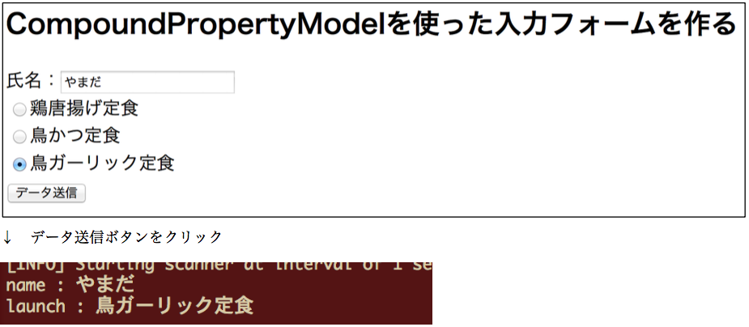

## 7. いろいろなModel：CompoundPropertyModel

### 手順1

`org.wicket_sapporo.handson.beans` パッケージに以下のファイルを作る。

```java
package org.wicket_sapporo.handson.beans;

import java.io.Serializable;

public class UserLunch implements Serializable {
	private static final long serialVersionUID = 1L;

	private String name;
	private String lunch;

	public UserLunch() {
		this.name = "";
		this.lunch = "";
	}

	public String getName() {
		return name;
	}

	public void setName(String name) {
		this.name = name;
	}

	public String getLunch() {
		return lunch;
	}

	public void setLunch(String lunch) {
		this.lunch = lunch;
	}

}
```

### 手順2

`org.wicket_sapporo.handson.model_usage` パッケージに以下のファイルを作る。

CPMFormPage.html（FormPage.htmlを複製する）

CPModelFormPage.java

```java
package org.wicket_sapporo.handson.model_usage;

import org.apache.wicket.markup.html.WebPage;
import org.apache.wicket.markup.html.form.Form;
import org.apache.wicket.markup.html.form.RadioChoice;
import org.apache.wicket.markup.html.form.TextField;
import org.apache.wicket.model.CompoundPropertyModel;
import org.apache.wicket.model.IModel;
import org.apache.wicket.model.util.ListModel;
import org.wicket_sapporo.handson.beans.UserLunch;

import java.util.Arrays;
import java.util.List;

public class CPMFormPage extends WebPage {
	private static final long serialVersionUID = 1L;

	
	public CPMFormPage() {
		// wicket:idとUserLunchのフィールド変数を関連づける CompoundPropertyModel を準備
		IModel<UserLunch> userLunchModel = new CompoundPropertyModel<>(new UserLunch());

		// Form以下のコンポーネントにuserLunchModelの能力を適用する
		Form<UserLunch> form = new Form<UserLunch>("form", userLunchModel) {
			private static final long serialVersionUID = 1L;

			@Override
			protected void onSubmit() {
				super.onSubmit();
				System.out.println("name : " + getModelObject().getName());
				System.out.println("launch : " + getModelObject().getLunch());
				setResponsePage(new CPModelConfirmationPage(getModel()));
			}
		};
		add(form);

		// 入出力データは userLunch の name を参照する
		TextField<String> nameField = new TextField<>("name");
		form.add(nameField);

		List<String> lunches = Arrays.asList("鶏唐揚げ定食", "鳥かつ定食", "鳥ガーリック定食");
		IModel<List<String>> lunchesModel = new ListModel<>(lunches);

		// 入出力データは userLunch の lunch を参照する
		RadioChoice<String> radioChoice = new RadioChoice<>("lunch", lunchesModel);
		form.add(radioChoice);

	}

}
```

### 手順3

**練習： HomePage.htmlとHomePage.java を修正して、CPMFormPageに移動できるLinkを追加しなさい。**

### 動作確認

􏰘􏰙􏰒􏰏􏰚􏰎􏰛􏰁􏰑􏰜􏰝􏰉􏰊􏰞􏰟􏰈􏰐􏰌􏰓􏰠􏰠􏰄􏰍􏰡􏰀アプリケーションを再起動して、ブラウザで [http://localhost:8080/](http://localhost:8080/)  からCPMFormPageに移動し、動作を確認する。

入力フォームから送信された値がコンソールに表示できていればOK。



[ハンズオン3](HandsOn03.md)と同じ機能になっているが、ソースコードの実装はどう異なっているかを確認する。

### 手順4

**練習： [ハンズオン4](HandsOn04.md)のように、選択内容を確認するページを作り、動作を確認しなさい。**

完成したら、模範解答の[html](../src/main/java/org/wicket_sapporo/handson/model_usage/CPMConfirmationPage.html),[Java](../src/main/java/org/wicket_sapporo/handson/model_usage/CPMConfirmationPage.java)と見比べて、模範解答と同じように修正しなさい。

----

[ハンズオン8へ](./HandsOn08.md)
