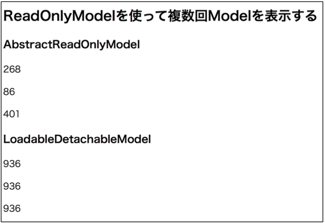

## 8. いろいろなModel：AbstractReadOnlyModel

### 手順1

`com.example.model_usage` パッケージに以下のファイルを作る。

ROMPage.html

```html
<!DOCTYPE html>
<html xmlns:wicket="http://wicket.apache.org">
<head>
  <meta charset="UTF-8">
  <title>ReadOnlyModelPage</title>
</head>
<body>
<h2>ReadOnlyModelを使って複数回Modelを表示する</h2>

<h3>AbstractReadOnlyModel</h3>
<p wicket:id="ro1"></p>
<p wicket:id="ro2"></p>
<p wicket:id="ro3"></p>

<h3>LoadableDetachableModel</h3>
<p wicket:id="ld1"></p>
<p wicket:id="ld2"></p>
<p wicket:id="ld3"></p>
</body>
</html>
```

ROMPage.java

```java
package com.example.model_usage;

import org.apache.wicket.markup.html.WebPage;
import org.apache.wicket.markup.html.basic.Label;
import org.apache.wicket.model.AbstractReadOnlyModel;
import org.apache.wicket.model.IModel;
import org.apache.wicket.model.LoadableDetachableModel;

import java.util.Random;

/**
 * AbstractReadOnlyModel, LoadableDetachableModel の動作ページの例.
 */
public class ROMPage extends WebPage {
	private static final long serialVersionUID = 1L;

	/**
	 * コンストラクタ.
	 */
	public ROMPage() {

		IModel<Integer> aroModel = new AbstractReadOnlyModel<Integer>() {
			private static final long serialVersionUID = 1L;

			@Override
			public Integer getObject() {
				// getObjectされるたびに、異なるオブジェクトを返す
				return getRandomInt();
			}
		};

		Label ro1Label = new Label("ro1", aroModel);
		add(ro1Label);
		Label ro2Label = new Label("ro2", aroModel);
		add(ro2Label);
		Label ro3Label = new Label("ro3", aroModel);
		add(ro3Label);

		IModel<Integer> ldModel = new LoadableDetachableModel<Integer>() {
			private static final long serialVersionUID = 1L;

			@Override
			protected Integer load() {
				// リクエストからレスポンスの間（もしくはdetachされるまで）は、同じオブジェクトを返す
				return getRandomInt();
			}
		};

		Label ld1Label = new Label("ld1", ldModel);
		add(ld1Label);
		Label ld2Label = new Label("ld2", ldModel);
		add(ld2Label);
		Label ld3Label = new Label("ld3", ldModel);
		add(ld3Label);

	}

	public int getRandomInt() {
		return new Random().nextInt(1000);
	}

}
```

### 手順2

**練習： HomePage.htmlとHomePage.java を修正して、ROMPageに移動できるLinkを追加しなさい。**

### 動作確認

􏰘􏰙􏰒􏰏􏰚􏰎􏰛􏰁􏰑􏰜􏰝􏰉􏰊􏰞􏰟􏰈􏰐􏰌􏰓􏰠􏰠􏰄􏰍􏰡􏰀アプリケーションを再起動して、ブラウザで [http://localhost:8080/](http://localhost:8080/)  からROMPageに移動し、動作を確認する。

確認事項は3つ。

1. AbstractReadOnlyModel を用いたコンポーネントではコンポーネントごとに異なる乱数が表示されていること
2. LoadableDetachableModel を用いたコンポーネントでは、全て同じ値が統一されている
3. 1〜2 の動作はそのままに、画面を更新する度に表示される値が変わっていること

つまり、

- AbstractReadOnlyModelは、コンポーネントが値を取り出す度に `getObject()` が実行される
- LoadableDetachableModelは、コンポーネントが最初に値を取り出した時に `load()` の実行結果を一時保存し、画面が表示される度に更新される




----

[ハンズオン9へ](./HandsOn09.md)


