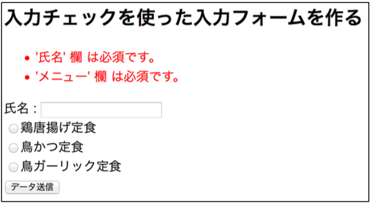

## 10. バリデータ（入力チェック）

### 手順1

`org.wicket_sapporo.handson.validation` パッケージに以下の3つのファイルを作成する。

ValidationFormPage.html

```html
<!DOCTYPE html>
<html xmlns:wicket="http://wicket.apache.org">
<head>
  <meta charset="UTF-8">
  <title>ValidationFormPage</title>
  <style>
    <!--
    .feedbackPanelERROR {
      color: red;
    }

    .feedbackPanelINFO {
      color: green;
    }

    -->
  </style>
</head>
<body>
<h2>入力チェックを使った入力フォームを作る</h2>
<form wicket:id="form">
  <div wicket:id="feedback"></div>
  氏名 : <input type="text" wicket:id="name">
  <div wicket:id="lunch"></div>
  <button type="submit">データ送信</button>
</form>
</body>
</html>
```

ValidationFormPage.java

```java
package org.wicket_sapporo.handson.validation;

import org.apache.wicket.markup.html.WebPage;
import org.apache.wicket.markup.html.form.Form;
import org.apache.wicket.markup.html.form.RadioChoice;
import org.apache.wicket.markup.html.form.TextField;
import org.apache.wicket.markup.html.panel.FeedbackPanel;
import org.apache.wicket.model.CompoundPropertyModel;
import org.apache.wicket.model.IModel;
import org.apache.wicket.model.util.ListModel;
import org.apache.wicket.validation.validator.StringValidator;
import org.wicket_sapporo.handson.beans.UserLunch;

import java.util.Arrays;
import java.util.List;

/**
 * 入力チェックを加えた CPMFormPage.
 */
public class ValidationFormPage extends WebPage {
	private static final long serialVersionUID = 1L;

	/**
	 * コンストラクタ.
	 */
	public ValidationFormPage() {
		IModel<UserLunch> userLunchModel = new CompoundPropertyModel<>(new UserLunch());

		Form<UserLunch> form = new Form<UserLunch>("form", userLunchModel) {
			private static final long serialVersionUID = 1L;

			@Override
			protected void onSubmit() {
				super.onSubmit();
				System.out.println("name : " + getModelObject().getName());
				System.out.println("launch : " + getModelObject().getLunch());
				if (getModelObject().getLunch().equals("鳥ガーリック定食")) {
					error(getModelObject().getName() + "さん、鳥ガーリック定食は売り切れです...");
				} else {
					info(getModelObject().getName() + "さんの注文が完了しました！");
				}
			}
		};
		add(form);

		// エラーメッセージを表示するためのFeedbackPanelを用意
		FeedbackPanel feedbackPanel = new FeedbackPanel("feedback");
		form.add(feedbackPanel);

		TextField<String> nameField = new TextField<String>("name") {
			private static final long serialVersionUID = 1L;

			@Override
			protected void onInitialize() {
				super.onInitialize();
				// テキストフィールドを必須にして、最小3文字最大8文字に設定する。
				setRequired(true);
				add(StringValidator.minimumLength(3));
				add(StringValidator.maximumLength(8));
			}
		};
		form.add(nameField);

		List<String> lunches = Arrays.asList("鶏唐揚げ定食", "鳥かつ定食", "鳥ガーリック定食");
		IModel<List<String>> lunchesModel = new ListModel<>(lunches);

		RadioChoice<String> radioChoice = new RadioChoice<String>("lunch", lunchesModel) {
			private static final long serialVersionUID = 1L;

			@Override
			protected void onInitialize() {
				super.onInitialize();
				// ラジオボタンの選択を必須にする。
				setRequired(true);
			}
		};
		form.add(radioChoice);

	}

}
```

ValidationFormPage.properties

```properties
#コンポーネントの名称（ラベル）の設定
form.name=氏名
form.lunch=メニュー
#Validationメッセージの上書き
RangeValidator.minimum='${label}' は ${minimum} 以下にしてくださいね.
```

※eclipseの人はPropertyEditorを入れた方がいいかも [公式サイト](http://propedit.osdn.jp/), [Eclipse Market Place](https://marketplace.eclipse.org/content/properties-editor)

### 手順2

**練習： HomePage.htmlとHomePage.java を修正して、ValidationFormPageに移動できるLinkを追加しなさい。**

### 動作確認

􏰘􏰙􏰒􏰏􏰚􏰎􏰛􏰁􏰑􏰜􏰝􏰉􏰊􏰞􏰟􏰈􏰐􏰌􏰓􏰠􏰠􏰄􏰍􏰡􏰀アプリケーションを再起動して、ブラウザで [http://localhost:8080/](http://localhost:8080/)  からValidationFormPageに移動し、動作を確認する。

いろいろな値を入れてみて、エラー文が表示される事を確認する。



----

[ハンズオン11へ](./HandsOn11.md)


