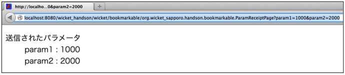
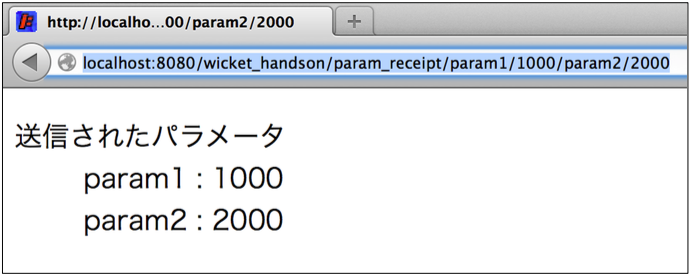

## 11. BookmarkableとCleanURL（URLの固定）

### 手順1

`com.example.bookmarkable` パッケージに、下の4ファイルを作成する。

ParamSendPage.html

```html
<!DOCTYPE html>
<html xmlns:wicket="http://wicket.apache.org">
<head>
  <meta charset="UTF-8">
  <title>ParamSendPage</title>
</head>
<body>
<h2>Bookmarkable(CleanURL)でのリンク</h2>
<p><a wicket:id="withoutParamLink">パラメータなし</a></p>
<p><a wicket:id="withinParamLink">パラメータあり</a></p>
</body>
</html>
```

ParamSendPage.java

```java
package com.example.bookmarkable;

import org.apache.wicket.markup.html.WebPage;
import org.apache.wicket.markup.html.link.BookmarkablePageLink;
import org.apache.wicket.request.mapper.parameter.PageParameters;

public class ParamSendPage extends WebPage {
	private static final long serialVersionUID = 1L;

	public ParamSendPage() {
		BookmarkablePageLink<Void> withoutParamLink =
			new BookmarkablePageLink<>("withoutParamLink", ParamReceiptPage.class);
		add(withoutParamLink);

		// 送信するパラメータを準備.
		PageParameters pageParameters = new PageParameters();
		pageParameters.add("param1", "1000");
		pageParameters.add("param2", "2000");

		BookmarkablePageLink<Void> withinParamLink =
			new BookmarkablePageLink<>("withinParamLink", ParamReceiptPage.class, pageParameters);
		add(withinParamLink);
	}

}
```

ParamReceiptPage.html

```html
<!DOCTYPE html>
<html lang="ja" xmlns:wicket="http://wicket.apache.org">
<head>
  <meta charset="UTF-8"/>
</head>
<body>
<dl>
  <dt>送信されたパラメータ</dt>
  <dd>param1 : <span wicket:id="param1"></span></dd>
  <dd>param2 : <span wicket:id="param2"></span></dd>
</dl>
</body>
</html>
```

ParamReceiptPage.java

```java
package com.example.bookmarkable;

import org.apache.wicket.markup.html.WebPage;
import org.apache.wicket.markup.html.basic.Label;
import org.apache.wicket.model.IModel;
import org.apache.wicket.model.Model;
import org.apache.wicket.request.mapper.parameter.PageParameters;

public class ParamReceiptPage extends WebPage {
	private static final long serialVersionUID = 1L;

	public ParamReceiptPage() {
		this(null);
	}

	public ParamReceiptPage(PageParameters params) {
		IModel<String> param1Model = Model.of("パラメータが送信されていません");
		IModel<String> param2Model = Model.of("パラメータが送信されていません");
		if (params != null) {
			// URLクエリパラメータを取得する。toStringメソッドの引数はパラメータの値が無いときの初期値.
			// BookmaekablePageLinkでアクセスされた場合のURLやパラメータ文字列形式の設定は WebApplication クラスのサブクラスで行います.
			param1Model.setObject(params.get("param1").toString("パラメータがありません"));
			param2Model.setObject(params.get("param2").toString("パラメータがありません"));
		}
		add(new Label("param1", param1Model));
		add(new Label("param2", param2Model));
	}

}
```
### 手順2

**練習： HomePage.htmlとHomePage.java を修正して、ParamSendPageに移動できるLinkを追加しなさい。**

### 動作確認1

􏰘􏰙􏰒􏰏􏰚􏰎􏰛􏰁􏰑􏰜􏰝􏰉􏰊􏰞􏰟􏰈􏰐􏰌􏰓􏰠􏰠􏰄􏰍􏰡􏰀アプリケーションを再起動して、ブラウザで [http://localhost:8080/](http://localhost:8080/)  からParamSendPageに移動し、動作を確認する。

パラメータなしのリンクをクリックすることで、ParamReceiptPageに移動し、**URLのファイルパス部が「パッケージ名＋クラス名」で表示**される。

パラメータありのリンクをクリックすることで、ParamReceiptPageに移動し、**URLの末尾にパラメータ（?param1=...）が表記されている**ことを確認する。




### 手順3

WicketApplicationクラスのinitメソッドに、MoutedMaperを追加する。

```java
	@Override
	public void init() {
		super.init();
		// サーバ・クライアント間のリクエスト・レスポンスの文字エンコード
		getRequestCycleSettings().setResponseRequestEncoding("UTF-8");
		// Wicketに取り込まれるHTMLファイルのエンコード
		getMarkupSettings().setDefaultMarkupEncoding("UTF-8");
		// URLのマウント
		mount(new MountedMapper("/param_receipt", ParamReceiptPage.class, new UrlPathPageParametersEncoder()));
	}
```

### 動作確認2

􏰘􏰙􏰒􏰏􏰚􏰎􏰛􏰁􏰑􏰜􏰝􏰉􏰊􏰞􏰟􏰈􏰐􏰌􏰓􏰠􏰠􏰄􏰍􏰡􏰀アプリケーションを再起動して、ブラウザで [http://localhost:8080/](http://localhost:8080/)  からParamSendPageに移動し、動作を確認する。

パラメータなし・パラメータありのリンクで、**URLのファイルパス部が手順3で指定したものになっている**ことを確認する。



----

[HandsOn12](HandsOn12.md)