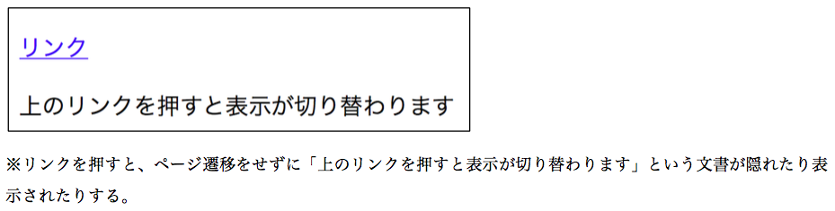

## 13. Ajax（画面の部分更新）


### 手順1

`org.wicket_sapporo.handson.ajax` パッケージに以下の2つのファイルを作成する

VisibleChangePage.html

```html
<!DOCTYPE html>
<html lang="ja" xmlns:wicket="http://wicket.apache.org">
<head>
  <meta charset="UTF-8"/>
</head>
<title>ParamSendPage</title>
<body>
<p><a wicket:id="link">リンク</a></p>
<p wicket:id="visible">上のリンクを押すと表示が切り替わります</p>
</body>
</html>
```

VisibleChangePage.java

```java
package org.wicket_sapporo.handson.ajax;

import org.apache.wicket.ajax.AjaxRequestTarget;
import org.apache.wicket.ajax.markup.html.AjaxLink;
import org.apache.wicket.markup.html.WebMarkupContainer;
import org.apache.wicket.markup.html.WebPage;

/**
 * Ajaxでコンポーネントの表示・非表示を部分的に切り替える
 */
public class VisibleChangePage extends WebPage {
	private static final long serialVersionUID = 1L;

	public VisibleChangePage() {
		// 匿名クラスの内部から参照される変数はfinal宣言が必要
		final WebMarkupContainer green = new WebMarkupContainer("visible") {
			private static final long serialVersionUID = 1L;

			@Override
			protected void onInitialize() {
				super.onInitialize();
				// Ajaxの更新対象となるコンポーネントには setOutputMarkupId(true) を実行する.
				// これにより、JavaScriptがフックするための id がタグに加えられる.
				setOutputMarkupId(true);
				// 非表示（visible = false）状態から表示（visible = true）になる可能性があるタグには、
				// setOutputMarkupPlaceholderTag(true) を実行する。これにより、表示上は消えても、JavaScriptが
				// フックできるタグが残る.
				setOutputMarkupPlaceholderTag(true);
				setVisible(false);
			}

			@Override
			protected void onConfigure() {
				super.onConfigure();
				// コンポーネントがAjaxなどで更新される度に実行されるメソッド.
				// ここでは、コンポーネントの表示/非表示状態を切り替えている.
				setVisible(!isVisibleInHierarchy());
			}
		};
		add(green);

		add(new AjaxLink<Void>("link") {
			private static final long serialVersionUID = 1L;

			@Override
			public void onClick(AjaxRequestTarget target) {
				// AjaxLinkがクリックされた時の処理
				target.add(green);
			}

		});
	}

}
```

## 手順2

**練習： HomePage.htmlとHomePage.java を修正して、VisibleChangePageに移動できるLinkを追加しなさい。**

## 動作確認

􏰘􏰙􏰒􏰏􏰚􏰎􏰛􏰁􏰑􏰜􏰝􏰉􏰊􏰞􏰟􏰈􏰐􏰌􏰓􏰠􏰠􏰄􏰍􏰡􏰀アプリケーションを再起動して、ブラウザで [http://localhost:8080/](http://localhost:8080/)  からVisibleChangePageに移動し、動作を確認する。

リンクの押下でペ ージ遷移せずにメッセージの表示・非表示が切り替わることを確認する。



----

オワリ